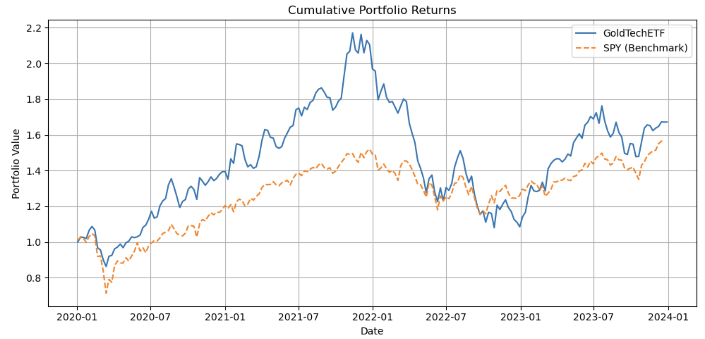
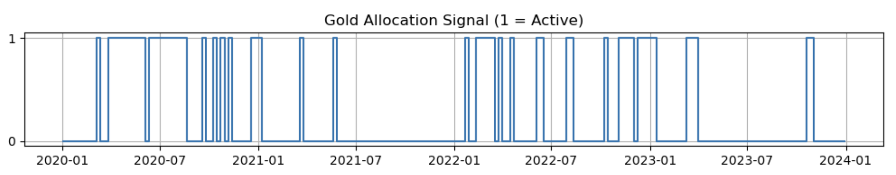
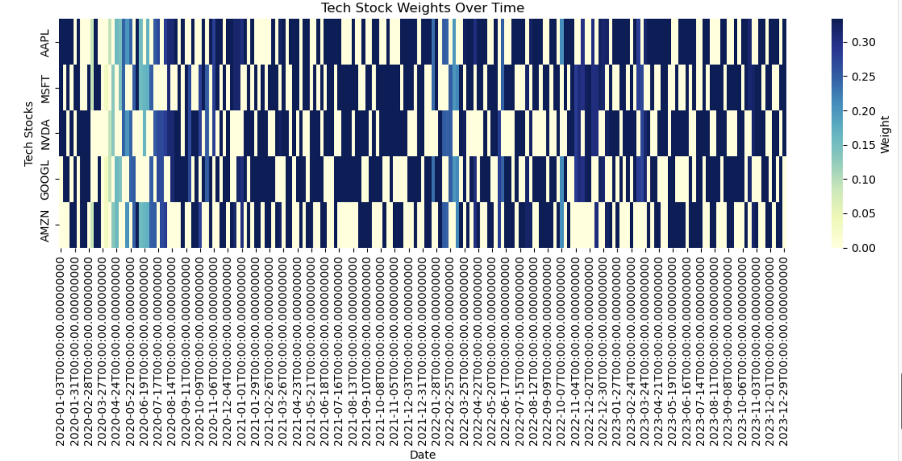

# GoldTechETF: A Thematic, Actively Managed ETF

This project presents an actively managed exchange-traded fund (ETF) strategy that dynamically allocates capital between U.S. technology stocks and gold, guided by momentum and macroeconomic signals. The strategy is implemented in Python and includes full backtesting and visualization components.

---

## Project Overview

**GoldTechETF** is designed to balance high-growth potential with risk mitigation by investing in two complementary asset classes:

1. **U.S. Technology Growth Stocks**
   - Selected based on 1-week momentum
   - Represents the portfolio's growth engine

2. **Gold Commodity ETF (GLD)**
   - Allocated based on a trend-following filter (SMA) and macro risk filter (VIX > 20)
   - Serves as a macro hedge and defensive anchor

This ETF is suitable for retail and institutional investors seeking tactical exposure to equity markets while retaining protection during periods of volatility.

---

## Investment Thesis

- **Tech equities** deliver sustained growth and innovation.
- **Gold** remains a historical safe haven, especially in uncertain macro environments.
- Combining these assets via active, rule-based reallocation can provide superior risk-adjusted returns over time.

---

## Methodology

The strategy is:

- Momentum-driven (weekly ranking of NASDAQ tech stocks)
- Rule-based GLD allocation using trend (SMA) and macro (VIX)
- Equal-weighted among selected assets
- Rebalanced weekly
- Backtested over the 2020–2024 period


---

## Tools Used

The following tools and methods will be used throughout the project:

- `Python`: pandas, numpy, yfinance, matplotlib, seaborn
- `Data Source`: Yahoo Finance API via `yfinance`
- `Backtesting`: Custom logic (rules-based rebalancing)
- `Visualization`: Cumulative returns, signal timelines, asset weight heatmaps
- `Optional`: Streamlit app for parameter tuning (coming soon)

---

## Repository Structure

```bash
GoldTechETF/
├── README.md                 # Project overview (this file)
├── report.md                # Final project report (Week 10 deliverable)
├── src/
│   └── final_project.py     # Backtesting implementation script
├── data/
│   └── price_data.csv       # Optional: downloaded data backup
├── images/
│   ├── portfolio_vs_spy.png
│   ├── gold_signal.png
│   └── tech_weight_heatmap.png
├── notebooks/
│   └── strategy_demo.ipynb  # Jupyter demo (optional)
├── streamlit_app/
│   └── app.py               # Interactive dashboard (optional)
└── references/
    └── selected_papers.pdf  # Literature support
```
---

## Sample Outputs

**Cumulative Return vs SPY:**  


**GLD Allocation Signal Timeline:**  


**Tech Weight Heatmap Over Time:**  


---

## References

This project is guided by key literature on ETFs, technical trading strategies, risk management, and automated investing. Full citations are included in the `checkpoint_report.md` and `references/` folder.

---

## License

This is an academic project developed for educational purposes. All code and content are freely available under the MIT License unless otherwise noted.

