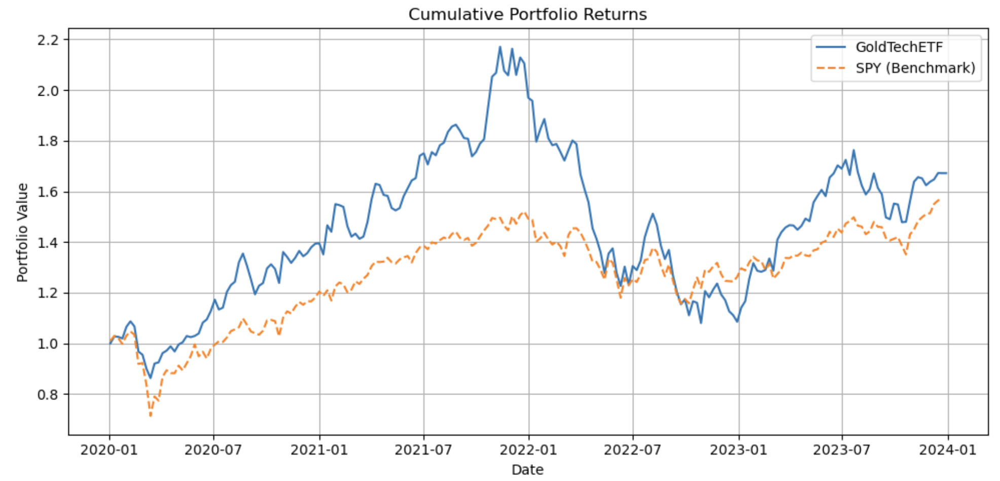
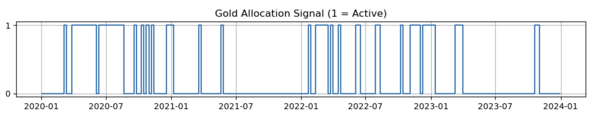
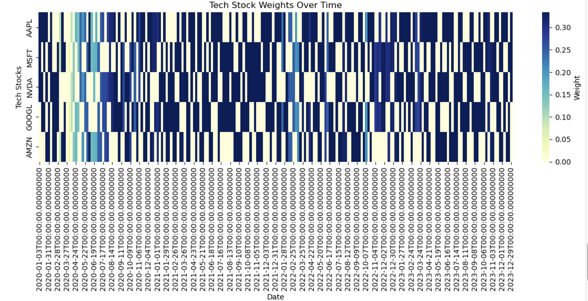

# GoldTech ETF Strategy Report

## 1. Introduction

In the current market environment where volatility is increasingly driven by macroeconomic uncertainty and technology remains a central growth engine, constructing a portfolio that combines cyclical growth exposure with defensive hedges is both timely and relevant. This report presents an actively managed ETF strategy—GoldTech ETF—that tactically allocates capital between top-performing U.S. technology stocks and gold ETFs, with entry rules governed by both momentum and macro risk signals. 

The core idea is to capture short- to medium-term momentum in tech equities while using gold (GLD) as a hedge during risk-off periods, detected via both trend-following signals and the VIX index. The goal is to evaluate whether this combined allocation can outperform a passive benchmark like SPY while managing downside risks.

## 2. Strategy Design

The GoldTech ETF strategy operates on a weekly frequency. Each week, the portfolio performs the following steps:

1. **Momentum-based Stock Selection:**
   - From a universe of five major technology stocks—AAPL, MSFT, NVDA, GOOGL, and AMZN—the strategy selects the top three based on 1-week return momentum.

2. **Gold Entry Signal:**
   - A 5-week simple moving average (SMA) is computed for GLD.
   - Simultaneously, VIX is monitored. If VIX > 20 and GLD is trading above its SMA, a "gold allocation signal" is activated.

3. **Weight Allocation:**
   - If gold is active: 25% of the portfolio is allocated to GLD, with the remaining 75% equally distributed among the selected tech stocks.
   - If gold is inactive: 100% is allocated across the selected tech stocks.

This design leverages both cross-sectional (momentum) and time-series (trend/VIX) signals to adaptively allocate capital.

## 3. Data and Methodology

We used weekly adjusted close price data from Yahoo Finance via the `yfinance` API, covering the period from **January 2020 to January 2024**. The tickers included:

- Technology stocks: AAPL, MSFT, NVDA, GOOGL, AMZN
- Hedge asset: GLD
- Macro risk index: ^VIX

Prices were resampled to weekly frequency (Friday close). All calculations and visualizations were conducted in Python using `pandas`, `numpy`, `matplotlib`, and `seaborn`.

## 4. Portfolio Construction

At each weekly rebalance date:

- **Top 3 tech stocks** are selected by their momentum (past 1-week return).
- **GLD inclusion** is determined by the conjunction of:
  - GLD > 5-week SMA, and
  - VIX > 20

Portfolio weights are computed accordingly and applied to the following week's returns. This ensures realistic forward-looking evaluation.

## 5. Performance Results

The cumulative return of the strategy is plotted against SPY as a passive benchmark.

**Chart 1:** Cumulative Portfolio Returns vs SPY  

The strategy significantly outperformed SPY over multiple periods, particularly during risk-off phases when GLD allocation was triggered.

**Annualized Performance:**
- Return: **13.71%**
- Volatility: **26.39%**
- Sharpe Ratio: **0.52** (Assuming 0% risk-free rate)

These values indicate a moderately aggressive portfolio with some downside protection via gold.

## 6. Signal and Allocation Behavior

To enhance interpretability, we present key signal visualizations:

**Chart 2:** Gold Allocation Signal Timeline  

**Chart 3:** Tech Stock Weights Heatmap Over Time  

From these, we observe that:
- Gold was predominantly active during market stress (e.g., mid-2020, 2022).
- Tech stock selections are dynamic but show frequent inclusion of NVDA and MSFT.

## 7. Discussion and Interpretation

The strategy offers an adaptive and interpretable framework. Its strength lies in combining:
- **Offensive growth exposure** via momentum-chasing tech stocks;
- **Defensive risk management** via gold during volatile periods (inferred from VIX);
- **Simplicity and transparency**, as rules are easily explainable and implementable.

However, the trade-off lies in higher volatility compared to SPY, and the strategy's performance can suffer during sharp rallies where gold acts as a drag.

## 8. Limitations and Future Work

- **Transaction costs** and slippage are not modeled.
- **Weighting schemes** are fixed and not optimized.
- GLD activation could be refined (e.g., using volatility-adjusted signals or rolling Sharpe ratios).

Future improvements could involve:
- Incorporating other asset classes (e.g., bonds, oil) for multi-asset exposure;
- Using machine learning to forecast momentum persistence;
- Deploying the strategy as an interactive Streamlit app with adjustable parameters.

## 9. Conclusion

The GoldTech ETF strategy presents a compelling, rules-based framework for navigating volatile markets. It outperformed a passive benchmark during key macro stress periods and maintained adaptability through dynamic equity selection. This highlights the value of blending tactical asset allocation with macro-informed hedging in a scalable ETF structure.

